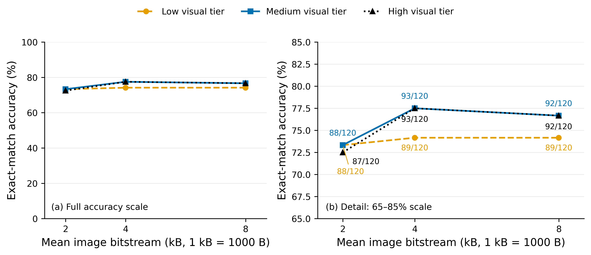
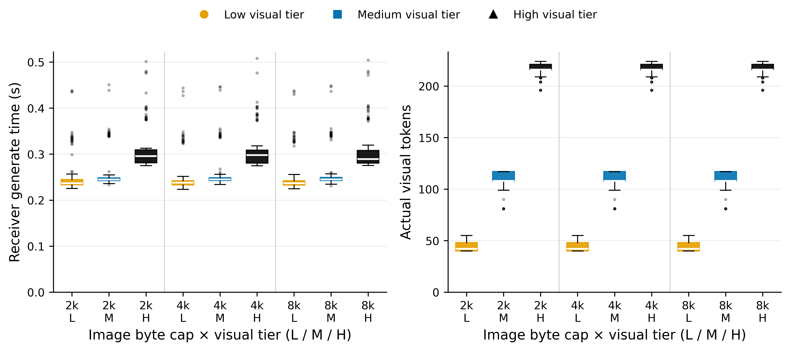

# RGB rate × receiver visual-budget: development analysis

## Question and comparison unit

Can independently varying actual image bitstream size and receiver visual preprocessing uncover an accuracy–communication–compute tradeoff worth learning? This is a completed, paired **120-question / 120-image development screen**, not an independent test. Each image/question has nine evaluations. The frozen receiver and codec are unchanged; no question gating or internal token pruning is introduced.

Primary reference: 4,000-byte image cap, high visual tier. The byte caps are 2,000/4,000/8,000 B, not nested packet prefixes. Visual tiers are verified by actual token counts rather than nominal pixel settings. Accuracy is project-normalized exact match, not VQA soft accuracy.

## Main findings

The 4,000-byte medium tier scores 93/120, versus 93/120 for the high tier, while mean visual-token count falls 48.93% and median generation latency falls 17.71%. Equal total correct counts do not imply identical per-question predictions. The measured latency reduction is not an energy measurement and does not establish accuracy equivalence on unseen data.

The preregistered efficient-fixed screen requires at most one lost answer, no increase in mean image bytes, and at least 20% median-latency reduction. Its outcome is **False**. The reported 4k/medium improvement must not be relabeled as satisfying the 20% threshold.

At λ=0.05, the answer-informed joint oracle reaches 100/120; the strongest rate-only oracle reaches 97/120, and the strongest compute-only oracle reaches 98/120. Joint routing-headroom screen: **True**. These are optimistic upper bounds using known answers; no trained router achieves these figures yet.

## Exact numeric summary

| Byte cap | Tier | Correct / N | Accuracy | Mean image B | Mean symbols | Mean tokens | Median generate s | Latency Q1–Q3 s | Energy J |
|---:|---|---:|---:|---:|---:|---:|---:|---:|---:|
| 2000 | low | 88/120 | 73.33% | 1996.50 | 21420.00 | 43.61 | 0.236785 | 0.233520–0.244715 | unavailable |
| 2000 | medium | 88/120 | 73.33% | 1996.50 | 21420.00 | 110.17 | 0.244846 | 0.242631–0.248289 | unavailable |
| 2000 | high | 87/120 | 72.50% | 1996.50 | 21420.00 | 215.75 | 0.295588 | 0.281095–0.309123 | unavailable |
| 4000 | low | 89/120 | 74.17% | 3995.43 | 42840.00 | 43.61 | 0.238012 | 0.233179–0.242070 | unavailable |
| 4000 | medium | 93/120 | 77.50% | 3995.43 | 42840.00 | 110.17 | 0.245083 | 0.242689–0.248440 | unavailable |
| 4000 | high | 93/120 | 77.50% | 3995.43 | 42840.00 | 215.75 | 0.297832 | 0.280548–0.308334 | unavailable |
| 8000 | low | 89/120 | 74.17% | 7993.07 | 85170.00 | 43.61 | 0.236551 | 0.232752–0.242104 | unavailable |
| 8000 | medium | 92/120 | 76.67% | 7993.07 | 85170.00 | 110.17 | 0.244979 | 0.242836–0.249353 | unavailable |
| 8000 | high | 92/120 | 76.67% | 7993.07 | 85170.00 | 215.75 | 0.289372 | 0.280566–0.307791 | unavailable |

## Figures and interpretation

Figure 1 tests whether more bytes or visual tokens reliably improve accuracy. Notice the full-scale panel and the explicitly labeled zoom, not only the small plotted differences. Medium at 4k matches high at 4k; larger byte or visual budgets need not improve exact-match answers. This supports investigating resource selection, but does not demonstrate a generalizable learned selector. Point estimates have no run-to-run error bars because only one frozen-model inference run exists; descriptive paired resampling appears in the appendix.

Figure 2 checks that the visual-budget intervention changes actual processing rather than only a configuration flag. Each box summarizes 120 individual question/image evaluations, not 120 training runs; medians, quartiles, 1.5-IQR whiskers, and outlying observations are shown. The token distributions separate strongly while latency savings are more modest. Therefore token reduction must not be reported as proportional energy reduction, and a latency screen should use measured generation time.

## Decision and limitations

Frozen screen recommendation: `consider_bounded_deployable_controller_training_then_freeze`. Any next controller must use deployable features, be trained without sealed-test answers, and be frozen before wireless and independent-test evaluation. The oracle is not a policy eligible for deployment.

All results are from a reused development set and a single checkpoint/runtime. Generation timing includes vision and language generation, but excludes image decoding and preprocessing; variability also reflects different answers and generated lengths. Aggregate timing is not complete end-to-end latency. Question/downlink communication is excluded by scope. LDPC complex-symbol counts are analytical payload accounting, not a measured channel-delivery curve. Energy is unavailable when telemetry is null. No statistical significance, low-SNR robustness, energy saving, or independent-test generalization is claimed.
