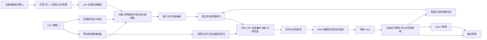

# 面向 VQA 的问题引导语义通信：系统架构与分阶段实现方案

日期：2026-09-18。用途：实验设计、代码实现和导师讨论。状态：设计方案；文中的新模块、训练规模和收益目标均待验证。本文件不修改论文，不代表新实验已经启动。

## 1. 核心决策与已有证据

主线采用“发送端问题引导的神经图像编码 → 数字无线传输 → 接收端 RGB 重建 → VQA”。实现顺序为：先验证问题是否改变有效视觉证据的编码，再验证分层传输及信道保护，最后训练接收端推理与补传决策网络。重建图像保留标准 RGB 接口，能够直接进入既有 Qwen 的原生图像预处理器。

| 已有实验 | 已观察到的结果 | 对本方案的约束 |
|---|---|---|
| TDIUC reconstruction holdout60 | JPEG 为 47/60、平均 7240 B；无问题神经 RGB 重建 B0 为 51/60、5313 B | 支持继续研究 RGB 路线；只有 60 题，且实际码率不同，不能作为严格等码率或显著性结论 |
| sender latent gate，24 张训练图、24 张开发图 | B0 与正确问题门控均为 21/24；上行字节减少 10.10%；计入问题下行后的旧复符号统计减少约 8.60% | 正确、错配、空问题的归一化回答完全相同，目前仅验证通用压缩适配，没有验证问题引导 |
| feature32 逐流压缩与接收适配器 | 12/24；自身、换图、零视觉输入回答完全相同 | 暂停该 4.17 kB 配置，保留诊断记录；不能将这一失败外推为所有特征通信不可行 |
| 现有 60 题信道结果 | 代码使用标定的包成功概率和衰落回放 | 不能称为本轮实际 LDPC 逐比特传输结果；新方案需要真实码流和可追踪的包级译码 |

本地证据：[60 题结果](/Users/zhangqiankun/Documents/mpu/phd_research/HPPO-VQA-TGCN/paper/outputs/tdiuc_reconstruction_holdout60_20260918/analysis-report.md)、[门控结果](/Users/zhangqiankun/Documents/mpu/phd_research/HPPO-VQA-TGCN/paper/outputs/sender_latent_gate_20260918/RESULTS_CN.md)、[feature32 修复结果](/Users/zhangqiankun/Documents/mpu/phd_research/HPPO-VQA-TGCN/paper/outputs/feature32_stream_adapter_20260918/analysis/analysis-report.md)。这些已查看过的样本今后统一作为历史诊断材料，不再用于确认性选模。

研究问题：在给定无线符号、时限和计算能量预算下，问题条件编码能否保留更多支持正确回答的视觉信息，并通过可靠传输与适度推理取得更优的准确率—资源权衡？“减少码流”与“降低系统总能耗”分别验证。

## 2. 最终系统架构及三阶段边界

图为最终目标，按以下增量实现，避免一次训练所有模块造成无法归因。

| 阶段 | 发送端 | 接收端 | 本阶段唯一主问题 |
|---|---|---|---|
| 优先级一 | 问题条件门控，完整的单个神经码流 | 固定 B0 RGB 解码器和固定 Qwen | 问题条件是否改善实际码率—VQA 性能？ |
| 优先级二 | 全局基础包＋独立增强包，任务价值引导保护 | 校验、分层融合，固定 Qwen | 同符号预算下，低 SNR 和包丢失时能否保住回答证据？ |
| 优先级三 | 按请求发送尚未接收的增强信息 | 轻量 VQA、学习型路由、Qwen | 计入全部计算与反馈后，是否降低完成任务的总能量？ |

问题由边缘端发起。默认下发 UTF-8 文本，UAV 在本地编码；短文本通常比浮点嵌入更容易计费和复现。下行必须包含 query_id、frame_id、问题编码版本、预算/截止时间及校验。下行失败时，该次任务计为失败或进入预先规定的重试；不能免费获得正确问题。问题不变、同一帧多问的缓存收益另设实验，默认单问单图计费。

上述问题下行只计入实际需要它的方法。B0/JPEG 的发送端不使用问题，不强制它们发送问题文本；仅计入各自必要的图像请求、帧号和预算控制头。统一的是物理信道与计费规则，不是人为强制所有方法承担相同消息。系统级比较以各方法实际上下行总符号为横轴，另外提供等上行字节对照以分离编码机制与反馈开销。

UAV 部署图像编码器、轻量语义网络、门控和通信模块；Qwen 留在接收端。监督训练中可在 GPU 上使用 Qwen 梯度，此训练成本与在线 UAV 开销分别报告。

## 3. 优先级一：把问题引导做实

### 3.1 模块设计

复用现有 CompressAI `bmshj2018-hyperprior`，以 quality 3 为第一个固定参考配置。其流程为分析变换 `g_a`、超先验 `h_a/h_s`、量化与熵编码、合成变换 `g_s`。旧编码器是稳定基座，其年代不作为创新点；先保持基座一致检验新增机制。[CompressAI 官方模型说明](https://interdigitalinc.github.io/CompressAI/models.html)

发送端计算：

\[
y=g_a(x),\quad v=V_{\rm small}(x),\quad t=T_{\rm small}(q),
\]
\[
m=G_\theta(y,v,t,b),\quad y_q=m\odot y,
\]
\[
\mathrm{stream}=\mathrm{EntropyEncode}\big(Q(y_q),Q(h_a(|y_q|))\big).
\]

其中 b 是码率档位/预算条件，m 是与潜变量空间对齐的连续抑制权重。保留权重下限，防止早期直接清空背景；下限在开发集选定，并有“无下限”消融。量化后仍对完整潜变量网格编码，零值依赖概率模型压缩，不能将零元素个数直接换算为发送字节。

第一版可训练网络约束为：投影维度 128、两层视觉—文本交叉注意力、四个注意力头，融合二维位置编码，输出空间与通道门控。参数量以代码统计为准。TinyCLIP 文本塔复用现有权重；视觉塔采用同一已缓存模型，提取一次全局图像的空间特征，再与 codec 潜变量对齐。单次全局提取是我们的候选实现，不等同于 PGP 的逐图块独立编码。若空间特征定位不充分，再在开发阶段比较有界的重叠图块提取，计入新增 UAV 成本。

保留原问题中的数量词、否定、属性和关系词；只移除回答格式指令。不能在问题预处理时去掉 left/right、not、how many 等决定任务的信息。

接收端只需要真实熵码流、形状与模型版本，即可通过原 B0 解码器得到 RGB。m 不参与逆变换，也不作为独立 side information 传输；其效果已进入 y_q。超先验码流、容器和元数据全部计费。第一版不使用问题条件熵模型，也不需要在接收端重算门控。

### 3.2 训练数据与防止语言先验

继续以 TDIUC 为连续性基准，增加 GQA balanced 的多问同图和关系问题。GQA 的问题与场景图可以用于构建训练监督；官方对象与关系标注仅在训练/诊断中使用，不进入部署推理。[GQA 官方数据说明](https://cs.stanford.edu/people/dorarad/gqa/download.html)

数据先审计，再确定数量：

1. 按源图像 ID 和图像哈希分组，排除历史所有训练、LoRA 微调、选模、反复查看的开发图及其重复图。跨数据集也检查重复；无法追溯的样本不作确认性测试。
2. 从训练划分选择同一图像至少两个有不同证据需求的问题，例如“车的颜色”和“右侧人的动作”。不同答案不等价于不同证据，需结合问题程序与标注判断。
3. 加入同题型、不同图像和不同答案的组，检验模型是否依赖视觉。计数题需要包含完整相关对象集合，关系题需要双方对象及上下文；不能只监督一个框。
4. 原有手工题和难例作为诊断附录。新测试集采用官方答案和固定官方评分规则，同时保留项目历史 exact match 便于追溯。

建议规模为：先用 32 张训练图完成小样本拟合；机制训练阶段使用 500—1000 张训练图、每图 2—4 问，另留约 200 张开发图。机制通过后才扩展训练和最终测试；最终测试目标不少于 1000 张独立图像/2000 个问答，实际规模根据开发集配对差异与目标精度确定。这些是预定预算，不是数据已准备完毕的声明。

跨阶段统一数据角色：上游模型训练集、策略/价值网络训练集、选模开发集、概率校准集、阶段评估集、最终封存测试集均按图像分组记录。进入策略阶段时，为其另分配未用于上游模型拟合的训练图，或用严格分组交叉拟合产生动作预测；校准集不参与任何模块参数训练。阶段评估一旦查看并影响后续研发，便登记为开发证据；最终系统必须在另一份此前未查看的封存集上验证，不能重复使用步骤 3 的结果证明最终收益。测试集无法满足隔离条件时，应报告探索性验证而非独立确认。

### 3.3 训练目标和冻结规则

\[
\mathcal L=\mathcal L_{\rm answer}
+\lambda_r\widehat R
+\lambda_d D(x,\hat x)
+\lambda_g\mathcal L_{\rm support}.
\]

- `answer`：冻结接收 Qwen 对真实答案的长度归一化交叉熵。仍需要梯度穿过 Qwen 视觉部分、RGB 解码器和可微图像预处理到达门控，不能对整个 Qwen 前向使用 `no_grad`。
- `R`：y、z 两种潜变量的负对数似然总比特数；每批除以同一基准像素数便于缩放。训练估计只作代理，选模使用实际 `compress/decompress` 字节及容器开销。
- `D`：RGB 或轻量感知失真正则，控制结构破坏；首版用 RGB MSE，强度只在开发集调节。
- `support`：对有可靠对象/关系标注的训练问题，监督证据覆盖。该项用于学习门控应关注哪里，不强迫模型在错配问题下故意答错。无可靠空间标注样本省略此项。

训练量化首版沿用现有 `training_quantization=True` 的加性均匀噪声代理，保持梯度；验证必须切到真实舍入、熵编码和解码，不把训练噪声输出当重建结果。记录估计码率与实际字节的偏差。若两者造成明显选模偏差，再单独验证直通舍入估计器，不与其他改动同时引入。

先冻结 codec、TinyCLIP、Qwen 和已有 standard LoRA，只训练融合门控；用证据监督和失真项预热，再加入答案损失和多码率训练。若门控已学会定位但码率—性能仍受限，第二个有界消融才解冻 `g_a` 末端小适配器，并与同容量、同训练数据的无问题适配器比较。解冻 `g_s` 或熵模型属于单独实验版本，需同步双方模型并重建熵编码表。

固定并记录图像尺寸、Qwen 像素预算、归一化、位置编码和生成参数。历史门控训练曾用 50176 像素预算，另一组接收评测使用 200704，不能直接合并解释。新版本先验证可微预处理与原生处理输出一致，再固定同一训练/评测配置；显存不足时选择较低的统一预算并重测全部对照，不能悄悄切换。原先较高预算结果仅保留为独立历史参考。

每个 batch 包含同图多问；预算档位跨 batch 采样。先在 2/4/8 kB 上行容器预算附近建立曲线，字节定义采用十进制。首版推理最多试三个预定档位，选实际码流满足预算的配置，禁止用答案挑档位。搜索的编码时间和能量必须计入，B0/JPEG 获得相同资源上限及其预定率控流程。

若三个候选均超预算，首版直接记录该次编码不可行并计为任务失败，不删除样本、不临时增加搜索；失败尝试的计算仍计费。若开发阶段发现频繁不可行，可预先定义包含降分辨率的新版三候选列表，再冻结后重新比较所有方法。选择过程不读取正确答案或测试评分。

不同预算可能需要不同数量的语义信息，不能要求所有高预算简单题都对错配问题敏感。问题依赖重点在预注册的紧预算和不同证据问题子集上检验。

### 3.4 必需对照与机制验收

| 对照 | 保持不变的条件 | 要排除的解释 |
|---|---|---|
| 无问题 B0；同容量无问题适配器 | 数据、更新预算、接收 Qwen、实际码率范围 | 收益只是更好的普通图像压缩或更多训练 |
| 正确问题；同图另一证据问题；空问题 | 最终接收端始终回答原问题；编码预算相同 | 收益不依赖问题语义 |
| PGP＋相同 codec | 预算、数据、接收器与计费边界 | 简单预滤波已能获得相同收益 |
| JPEG/BPG 或可用强图像 codec | 比较实际码率—准确率曲线 | 只与弱质量设置比较 |
| 原图/高质量全图输入 | 同一冻结 Qwen | 诊断通信前接收器能力；不作为零成本部署系统 |

同图错配仅改变发送端编码问题 q_enc，接收端回答问题固定为 q_eval。同时记录门控图变化、有效区域覆盖、码流长度、逐题答案差异。视觉换图/遮挡后对原标签的一致率只称敏感性指标，不称改变图像后的正确率。

工程晋级目标预先冻结：在至少两个相邻预算档位，相对同容量无问题适配器取得稳定的配对准确率收益，或在准确率差不超过 1 个百分点时减少至少 15% 的实际总通信符号；同时在证据需求不同的子集上体现正确问题相对错配/空问题的收益。开发阶段使用至少三个训练种子，效果不应只来自一个类别。数字是本项目目标，不是 JSAC 的录用门槛。

如果仍得到“问题不同、码流近似、答案相同”，先定位监督是否学会、TinyCLIP 是否能区分问题、梯度是否实际更新，再决定停止或有限修改；不能仅以普遍压缩率改善晋级“问题语义编码”。若优于无问题网络但与 PGP 相当，应记录为可复现的机制结果，创新收益尚不成立。

## 4. 优先级二：可交付的视觉证据与低 SNR 鲁棒性

### 4.1 从完整码流到独立增强包

普通超先验熵码流通常存在依赖关系。随机切掉后半段或把缺失 latent 填零，不构成已实现的渐进编码。优先实现一个可检查的数字方案：

- 基础包：首版采用问题无关 B0，对完整视野生成低码率 RGB 神经码流，独立包含超先验和主码流；问题条件只影响增强区域的选择及其编码。这样可以分离全局保底与任务细节的作用。
- 增强包：对规则网格的局部区域独立编码，每包自带超先验、坐标、尺度、模型版本与 CRC；候选窗口采用预定 4×4 网格及固定重叠边界，由学习到的问题证据分数排序，首版最多发送四个。网格分块不依赖 YOLO。
- 接收融合：基础图恢复到规定画布，增强图按坐标覆盖并在边缘平滑融合，保持目标的原始相对位置。首版增强包传 RGB 局部图像，不将其误称为“残差码流”。

这相当于“全局信息＋问题相关细节”，保持场景、数量与位置上下文。编码局部图会产生重复信息和头开销，必须与整图问题编码、均匀分块及 JPEG 渐进式/分块对照比较。它是验证传输机制的第一版，不能因分层本身宣称创新。

基础与增强的源容器预算比例先限定为 25%/50%/75% 三档，仅在开发集选择，并报告加上各自信道保护后的实际符号占比。候选窗口保留固定编号；发送时只编码选中的窗口，避免在线对全部窗口先做 Qwen 推理或完整熵编码。预算不足时减少增强单元，不允许超过实际总符号上限。

本阶段是新的封包与训练版本，不直接假设优先级一的整图门控能够迁移到小图块。初始化可复用其权重，但需在原训练划分上进行分包感知训练、模拟有效包融合，并重新冻结验证；局部门控还应接收全局语义上下文和原始窗口坐标。与同样训练的无问题分包网络比较，单列新增训练成本。

每个增强单元必须能独立解码；一个单元可能跨多个 LDPC 码块。各块译码并重组后，若整单元 CRC 失败，则丢弃整个单元，不影响其余单元；若另设块级校验，也单独记录。基础包完全丢失时默认失败并允许预算内的有限重传，不凭问题猜测场景。生成修复只能使用已成功接收的信息。

当独立增强方案通过后，才研究条件残差编码器：发送端和接收端共享完全相同的基础重建与模型版本，用量化残差补充局部证据。新增 residual codec 需要训练且存在基础包依赖，不能直接把有符号残差当普通 RGB 喂入原 B0。

### 4.2 问题条件修复的职责

已有 B0 解码器先恢复可读 RGB。小型修复网络以基础图、收到的增强图、有效性掩码和问题为输入，输出有幅度限制的 RGB 修正；以恒等映射初始化。训练时按实际包丢失模式随机屏蔽增强单元，并用答案损失、证据区域保真和全局结构约束训练。

其职责是融合现有证据、减轻压缩与局部缺失造成的任务损害。修复网络不得把未收到的内容描述为已传输信息；在对象数量、颜色、左右关系上必须做事实保持检查。先分别评估“发送端引导”“接收端条件修复”，再评估组合，得到 2×2 因子对照以定位收益来源。

扩散重建设为后续可选实验：只有小型修复器的收益不足、且资源允许时再引入。DiffCom 利用接收信道信号约束后验采样；我们丢包后的数字系统只有 CRC 通过的码流和擦除标记，不能把失败熵码流直接交给其扩散模型。要复用其机制，必须明确可微的信号观测模型，或另建数字擦除条件的生成重建实验，名称上区分原算法复现与思想借鉴。[DiffCom 原文及机制](https://arxiv.org/html/2406.07390v2)

### 4.3 统一信道和计费

所有数字方案使用同一 LDPC 实现、调制方式、功率归一化和信道轨迹。以 AWGN 为基础，Rician 为 UAV 候选链路，Rayleigh 为压力测试；记录平均 SNR 的定义和衰落功率归一化。先复现已有 PHY 参数，再在统一实现中开放保护档位。

SNR 点沿用 −5、0、2、4、6、8、10、12、15、20 dB；对瀑布区在开发阶段增加 1 dB 间隔。真实复基带噪声按 Es/N0 定义生成，明确与 Eb/N0 的换算，不能把它们直接作为同一数值。

1. 单包/多包预实验先运行真实比特、LDPC、调制、噪声和译码，建立不同包长与保护档位的 BLER 表。
2. 大规模模型选择允许使用该表加速，但标注为标定回放，并保留块间共享衰落；不能假定共享衰落块无条件独立。
3. 最终在关键 SNR 点做真实 PHY 复核，按完整实验帧实际到达的单元重建并回答。不同方法共享相同外部信道随机过程；长度不同的传输用其实际持续时间采样。

对于方向 d、传输单元 p、实际发送次数 a_p（含首传与重传）：

\[
N_{\rm total}=\sum_{d\in\{\uparrow,\downarrow\}}\sum_p\sum_{k=1}^{a_p}
\left[N_{\rm preamble,p,k}+N_{\rm pilot,p,k}
+\sum_b\left\lceil\frac{n_{p,k,b}}{\log_2 M_{p,k}}\right\rceil\right].
\]

这里 k 是发送尝试编号，n 是填充、CRC 和信道编码后实际发送的比特数，M 是该次调制阶数；前导、导频和 ACK 需按所采用链路模型明确计入或单列。上行与下行分别分包、填充和编码，不能先相加字节再做一次向上取整。现有 `run_independent.py` 中部分总符号采用合并字节计数，只可作为历史近似，本方案须改正。

优先级保护第一版固定调制和总符号预算，仅比较统一保护与学习到的重要性分配；保持总发射符号能量一致，增加某包保护就必须减少其他开销。之后才扩大为联合码率、保护和功率优化，避免收益归因混淆。

语义重要性监督只使用专门的价值网络训练划分，以“添加某个增强包后，答案损失下降多少”作为边际值标签；遵守 §3.2 的上游模型交叉拟合/隔离规则。开发集只选择超参数，不用于训练该预测器。部署时由轻量网络预测，不使用测试答案或先运行 Qwen 探索所有包。依赖、互补关系强时不能假设各包价值可简单相加。

### 4.4 指标与通过条件

分别记录完整码流交付率、基础包成功率、增强包成功率、期限内输出率、全样本端到端正确率和成功交付条件下的正确率。数字失败/超时/弃答在主端到端准确率中计为未答对；另外报告覆盖率与已输出答案的准确率。

低 SNR 下允许只有基础图或部分增强图可用，实际用它们完成 VQA，不能只将无损正确率乘上交付率代替部分恢复实验。各方法比较相同总符号预算或相同任务可靠性目标，画准确率—SNR 与准确率—符号曲线。基础包全丢失时不承诺继续维持高准确率。

晋级要求：相同总无线符号预算下，在预注册的低/中 SNR 区间，任务价值保护优于统一保护或内容无关优先级；高 SNR 不出现不可接受的准确率下降。若只在无损环境有效，则贡献限定为任务压缩，不声称信道鲁棒性。

## 5. 优先级三：训练接收端推理与补传决策

### 5.1 两类接收模型

高能力端使用当前固定 Qwen3-VL-4B-Instruct＋已有 standard LoRA，明确它并非未微调基座。轻量端首版复用已运行的 SmolVLM-Instruct 约 2B 作为工程对照；其参数更少不保证能耗更低，必须测量。如果不具备低能耗优势，再有界比较更小的视觉—文本融合 VQA 网络。闭集答案分类器与开放式 VLM 比较时，需单列答案覆盖率、未登录答案与完整基准成绩。

轻量模型按真实重建分布训练或蒸馏，训练样本包括基础图、完整增强图和随机缺包重建。监督使用官方答案；Qwen soft target 仅作辅助，并对教师错误进行筛选/降权。冻结独立测试集。改变接收模型后，所有表示方案都要在相同接收器上复测。

### 5.2 路由必须由可观察信息训练

先在策略专用训练数据生成动作结果表：问题表示、当前已收包和无参考重建质量特征、SNR 估计、轻量模型输出与校准置信度、剩余预算，配套记录各可行动作的正确性、时延和能耗。按图像分组训练、校准与验证，并采用 §3.2 的隔离或交叉拟合方式避免上游拟合过的图像导致动作标签过于乐观。

部署路由的质量特征限于重建 RGB 上可计算的模糊/块效应、有效包掩码和已收到的元数据等。PSNR、全参考 SSIM、相对原图的特征误差以及真实证据覆盖只用于离线评价，不能进入路由器。问题与包内容以外的源图、标注和未运行模型输出均不可访问；置信度的校准器也只能在单独校准划分上拟合。

用小型 MLP 预测每个动作的正确概率与增量代价。候选动作包括输出轻量答案、调用 Qwen、请求下一个增强单元、弃答/结束。首版一个交互请求最多携带两个增强包，整次任务最多两轮反馈，达到预算或时限立即终止。硬预算与终止规则属于协议约束，分支选择来自训练预测，不用题型规则预设路由。

“请求增强”本身没有回答正确性标签。单步训练时将其定义为完整候选流程，例如“请求指定窗口集合 → 融合重建 → 轻量模型回答”或“请求指定窗口集合 → 融合重建 → Qwen 回答”，按整条后续流程记录成功概率、增量时延和能量，并包含传输失败。先实现这些有界的单轮候选流程；升级到两轮时再使用有限时域回溯生成标签，不能把一次补传的局部收益当成整次任务的成功率。弃答是预算终止动作，不参与非零准确率门槛的可行集。

\[
a^*=\arg\min_{a\in\mathcal A_{\rm feasible}}
\widehat E(a)\quad\text{s.t.}\quad
\widehat p_{\rm correct}(a)\ge\tau,\quad\widehat T(a)\le T_{\rm remain}.
\]

概率在独立开发数据校准；这个约束是经验决策准则，不宣称逐样本正确率保证。没有达标动作时，按预注册策略请求可行增强或终止。Qwen 仅在被选中后运行；离线生成训练标签时允许运行所有动作，部署时不允许先看到它们的结果。

先验证单步决策，只有存在明确多轮依赖且单步模型受限，才考虑强化学习。无需为增加“路由”而引入复杂控制器。

### 5.3 能耗边界

\[
E_{\rm task}=E_{\rm UAV,encode}+E_{\rm UAV,semantic}
+E_{\rm radio,UL+DL+feedback}+E_{\rm receiver,decode}
+E_{\rm receiver,repair}+E_{\rm small}+E_{\rm router}
+\mathbb 1_{\rm Qwen}E_{\rm Qwen}+E_{\rm idle/wait}.
\]

已执行的轻量推理即使升级到 Qwen 也要计费；重编码、接收等待和重传按真实发生次数计费。逐设备能量与二者相加的系统能量分别报告。任务可变计算/通信开销为主要边界；UAV 飞行与摄像若各方法完全相同，作为共同项单列，只有实际测量后才讨论整机节能比例。

服务器 GPU 的 NVML 板卡能量不等价于整个接收端能量。可以取得能量计数器时优先采用；功率采样需足够长的重复区间、同步和空闲基线。UAV/无线硬件未测量部分用公开说明的模型估算，并提供敏感性分析；不得把 CPU/GPU 时间直接乘一个任意常数标注为实测能量。最终报告实测和估算分列。

除每次请求平均能量外，报告“全部请求消耗的能量 / 正确且按时完成的请求数”，同时给覆盖率。否则大量弃答可能造成虚假的节能。

工程目标：与固定 Qwen＋最佳固定传输配置相比，在准确率差不超过 1 个百分点的条件下，系统任务可变能量降低至少 20%。先做可达性检查：若轻量端本身不省电或无法可靠筛选，停止把双模型路由作为主贡献。

## 6. 需要借鉴的工作：原方法、采用部分与差异

以下为方法借鉴，不是将其结论直接移植到本项目。预印本方法描述与期刊接收状态分别核实；复现时固定所用版本。

| 工作 | 原工作具体怎么做 | 本方案采用什么 | 必须保留的差异/验证 |
|---|---|---|---|
| [GSC-VQA，JSAC 2025](https://arxiv.org/html/2411.02452v2) | 解析问题，提取对象信息及场景图三元组，按与问题的关联排序，在资源限制下发送前若干项 | 以问题相关证据为选择单位；关系题保留双方与关系上下文 | 属于直接竞争工作；问题引导本身不能列为首次贡献；其结构化表示与我们 RGB 码流不同 |
| [Prompt-Guided Prefiltering，ICME 2026 接收](https://arxiv.org/html/2604.00314v1) | TinyCLIP 编码问题和重叠图块，按相似度形成重要性图，给不重要区域更强高斯平滑，随后调用常规/神经 codec | 小模型承担 UAV 问题—图像关联，并保留完整图像布局；作为强对照 | PGP 是预滤波；我们拟在潜变量内用任务损失和真实率约束训练。需超过 PGP 的同资源曲线；论文主配置比本项目旧 TinyCLIP 更大 |
| [Aligning Task- and Reconstruction-Oriented Communications，JSAC 2025](https://eprints.gla.ac.uk/346349/1/346349.pdf) | 在信息瓶颈框架下训练编码器及信息重塑器，输出与原始数据同结构的任务输入；其自动驾驶实验冻结下游 TGCP，并设计星座约束 JSCC | 冻结下游模型，让任务梯度训练编码/重建接口 | 我们是 VQA 条件数字熵码流，首版不复现其调制法；RGB 接口与任务损失并非新的独立概念 |
| [YOTO，JSAC 2026](https://discovery.ucl.ac.uk/id/eprint/10221082/) | 多粒度视觉表示；SFS 依据局部熵选特征，CFS 结合信道信息选特征，Libra 协调保留比例；另用桥接模块支持多模态语言生成 | 内容价值与信道可靠性联合分配资源 | 源熵高不等于对某个问题重要；我们用任务证据价值替代单纯复杂度。该论文理解任务的描述生成结果不能等同于 VQA 准确率 |
| [DiffCom，JSAC 2025](https://arxiv.org/html/2406.07390v2) | 将接收信道信号作为扩散后验采样条件，并加入约束以兼顾数据先验和观测一致性 | 修复输出受真实接收信息约束；生成能力不能替代已传证据 | 原接收信号模型与数字 CRC 擦除不同，需单独适配；使用扩散时实测采样耗时与能量 |
| [Generative Semantic Communications with Foundation Models，JSAC 2025](https://arxiv.org/html/2411.04575v2) | 分别传文本提示、边缘等语义流；图像实验以 ControlNet/Stable Diffusion 重建，分析感知误差—传输可靠性关系并按语义价值分配功率 | 各增强包贡献不同，应有不同保护/资源 | 我们的价值定义为 VQA 任务收益，而非仅感知相似度；需要新的预测和验证，不能直接沿用其节能数字 |
| [DRL and IB Enabled Task-Oriented Semantic Communication，JSAC 2025](https://ieeexplore.ieee.org/document/11207682/) | 信息瓶颈刻画准确率—时延权衡，DRL 在动态衰落下选择语义特征维度 | 将任务结果与无线代价放到同一个决策目标 | 特征维度自适应已有先例；我们的路由需额外证明模型推理与反馈成本的收益 |

第一批详细复现优先级：PGP、问题无关神经 codec、GSC-VQA 可运行部分；Aligning 用于训练原则与冻结策略；DiffCom 作为后续生成接收器对照。若没有原作者可运行代码或数据接口不同，明确标注“受其启发的实现”，不使用“原论文复现”名义。

## 7. 统一实验设计与可接受的结论

| 实验 | 主要横轴/控制变量 | 首要指标 |
|---|---|---|
| 编码价值 | 相同实际字节预算；固定接收器 | 正确率、各题型均值、实际上下行字节和符号 |
| 问题依赖 | 同图正确/错配/空问题；接收端问题不变 | 配对正确率/损失差异、证据覆盖与码流变化 |
| 接收修复 | 发送引导与接收条件修复的 2×2 对照 | 净收益、修复引入的新错误、新增计算代价 |
| 无线鲁棒性 | 相同功率归一化、总符号预算和信道样本 | 全样本准确率、基础/完整交付率、超时率 |
| 决策收益 | 固定轻量、固定 Qwen、学习型策略；离线 oracle 只作上限 | 准确率、覆盖率、能量、时延、补传次数 |
| 泛化 | 新图、新问题组合/类别、未见信道条件 | 冻结模型后的退化幅度；不在测试集重新校准 |

保留既有 YOLOv8n/YOLO26n 方案作为历史对照，区分“检测结构化信息”和“ROI 图像”两种载荷，不能混称。若引入 RSVQA/T-DeepSC 或 GSC-VQA，统一公开各自训练数据、答案空间与适配范围，不将改造版本称为原论文的原始结果。

按图像而非问答对做配对重采样，避免同图多问被当作独立观测；训练随机性和信道随机性分别报告。正文可展示均值、跨种子标准差与配对差值，统计不确定性放附录。既不只挑一个最佳种子，也不把一个数据集的一次小样本提升作为一般结论。

最有价值的结果是完整的 Pareto 曲线：达到某个准确率需要多少真实无线符号与端到端能量。高质量全图的分数作为接收器参考，不称作理论上限，压缩偶尔去噪后也可能更高。

## 8. 代码复用和新增模块计划

新实现建议集中在一个独立实验目录，例如 `paper/outputs/question_guided_semcom_v2/`；旧结果保持可追溯。下表仅为拟建接口，尚未创建或运行这些模块。

| 拟建模块 | 输入与输出 | 可复用基础 |
|---|---|---|
| `prepare_grouped_data.py` | 原始问题/图像/标注 → 分组 manifest、来源与排除审计 | 现有 TDIUC/GQA manifests |
| `question_codec.py` | 图像、问题、预算 → 门控潜变量/完整真实码流 | `sender_latent_gate.../latent_gate.py` |
| `train_codec.py` | 多问同图批次 → 固定版本模型与训练记录 | 现有可微 Qwen patchify 与答案 CE 梯度通路 |
| `wire_v2.py` | 基础/增强单元 → 独立 CRC 容器及元数据 | `receiver_reconstruction_demo.../wire.py` |
| `phy_eval.py` | 实际容器、信道配置、随机种子 → 恢复单元、BLER、符号账本 | 既有统一信道实现；旧 logistic 回放只用于初期加速 |
| `rgb_receiver.py` | 有效单元、掩码、问题 → RGB 与修复记录 | 原 B0 解码器与图像尺寸处理 |
| `action_table.py`、`train_policy.py` | 训练样本与可行动作 → 成功概率/代价模型 | 旧路由代码接口，重新生成适用本系统的标签 |
| `evaluate.py`、`energy_meter.py` | 冻结配置 → 配对结果、资源账本和能量记录 | 现有 scoring、profiling；显式区分实测与估算 |

具体可复用文件：[门控及可微处理](/Users/zhangqiankun/Documents/mpu/phd_research/HPPO-VQA-TGCN/paper/outputs/sender_latent_gate_20260918/latent_gate.py)、[训练与真实编码流程](/Users/zhangqiankun/Documents/mpu/phd_research/HPPO-VQA-TGCN/paper/outputs/sender_latent_gate_20260918/run_experiment.py)、[CRC 容器](/Users/zhangqiankun/Documents/mpu/phd_research/HPPO-VQA-TGCN/paper/outputs/receiver_reconstruction_demo_20260917/wire.py)、[能耗采样](/Users/zhangqiankun/Documents/mpu/phd_research/HPPO-VQA-TGCN/paper/outputs/receiver_reconstruction_demo_20260917/profiling.py)、[现有信道回放范围](/Users/zhangqiankun/Documents/mpu/phd_research/HPPO-VQA-TGCN/paper/outputs/tdiuc_reconstruction_holdout60_20260918/run_independent.py:280)。

质量检查集中在影响结论的环节：真实压缩解压一致性；问题/答案泄漏；可微与原生图像处理一致性；上下行独立计费；增强包独立解码；CRC 失败路径；接收端对源图无访问；功率与时间记录同步。先验证小规模机制，再扩展测试。

## 9. 执行顺序与每一步交付物

| 步骤 | 工作 | 完成标准与交付 |
|---|---|---|
| 0 | 整理旧证据、冻结评测规则、建立新图像分组 | `protocol.json`、样本排除清单、模型/数据哈希；首先确认 LoRA 训练来源 |
| 1 | 32 图拟合与 20—30 图人工可解释性检查 | 梯度有效、可复现真实码流、问题能定位不同证据；人工查看仅诊断，不人工重标基准答案 |
| 2 | 有界机制训练与 PGP/无问题对照 | 约 500—1000 训练图，3 个种子；完整率—准确率曲线及问题依赖报告 |
| 3 | 冻结阶段模型后做图像独立的阶段评估 | 检查优先级一门槛；查看后登记为研发证据，不能再作最终盲测；未通过则停止此配置，不自动扩大 |
| 4 | 独立增强封包、真实信道、价值保护 | 对齐无线预算后的低 SNR 结果；无效则保留压缩贡献，不宣称鲁棒性 |
| 5 | 小型接收修复与事实保持测试 | 2×2 对照、净增正确/错误、代价；扩散只有必要时进入 |
| 6 | 轻量 VQA 适配、动作表、训练决策网络 | 相近准确率下的总能耗收益及预算遵守记录 |
| 7 | 冻结最终系统，在另留的封存集上做泛化与基线复核 | 独立完整报告、可复运行命令、失败案例及资源明细；若依据结果再改系统，需新的确认集或明确探索性结论 |

暂不承诺 GPU 小时数。步骤 1 实测每批训练和真实编码耗时后，用样本量、步数和三种子预算估算，并将最大训练步数与磁盘/显存上限写入配置。每一步原始日志落盘，主报告只保留汇总指标与必要错误摘要。

## 10. 预期贡献边界与风险处理

候选贡献一是问题条件编码在真实码流中的任务收益；候选贡献二是以回答证据价值驱动的分层保护与部分恢复；候选贡献三是统一计算和通信成本的可靠性预测与决策。是否能成为论文贡献取决于与强基线比较后的证据，不能仅因组合了这些模块而成立。

风险及动作：问题门控退化为统一衰减时，优先修数据和证据监督；重建创造错误对象/属性时，减少生成自由度并强化观测一致性；下行或独立包头抵消压缩收益时，调整分包粒度或停用该层；轻量模型先运行再升级导致能耗上升时，检验更便宜的预路由或取消双模型；跨接收器失效时，将贡献限定为已验证接收器适配，不宣称普适。

对缺包后的生成式修复，不应让问题先验凭空替代图像。须同时保留“基础图直接回答”“基础图＋无问题修复”“基础图＋问题修复”对照，并审查数量、颜色与关系的变化；样例好看不足以证明任务证据保留。

## 11. 方案交付检查

- 能明确回答：问题从哪里来、怎样到 UAV、双方部署什么、实际传输什么、接收端凭什么解码。
- 三阶段分别有固定基线、冻结边界、验证门槛和失败后的停止条件。
- 当前已观察结果与新方案目标区分；历史开发集不被重新包装为独立测试。
- 真实字节、源侧边信息、上下行信道符号、重传、计算及等待开销均有计费位置。
- 对参考论文区分原方法、复用部分和本项目新增假设；未将生成质量指标当作 VQA 正确率。

下一项可实施工作是步骤 0—2：构建无泄漏的多问同图训练/开发数据，升级问题—视觉融合门控，与同容量无问题适配器及 PGP 在真实字节预算下进行机制验证。
